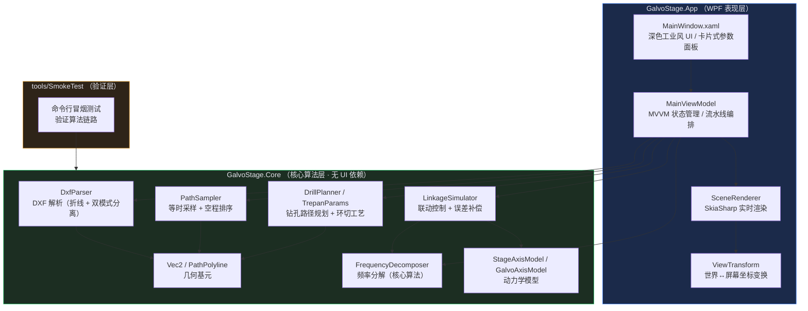
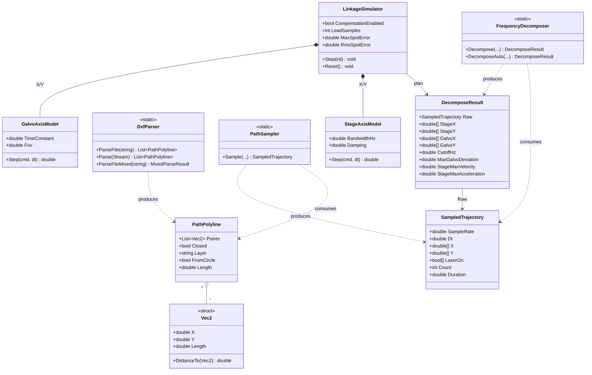
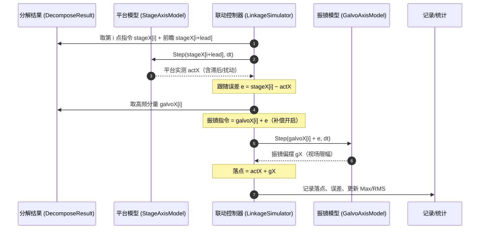
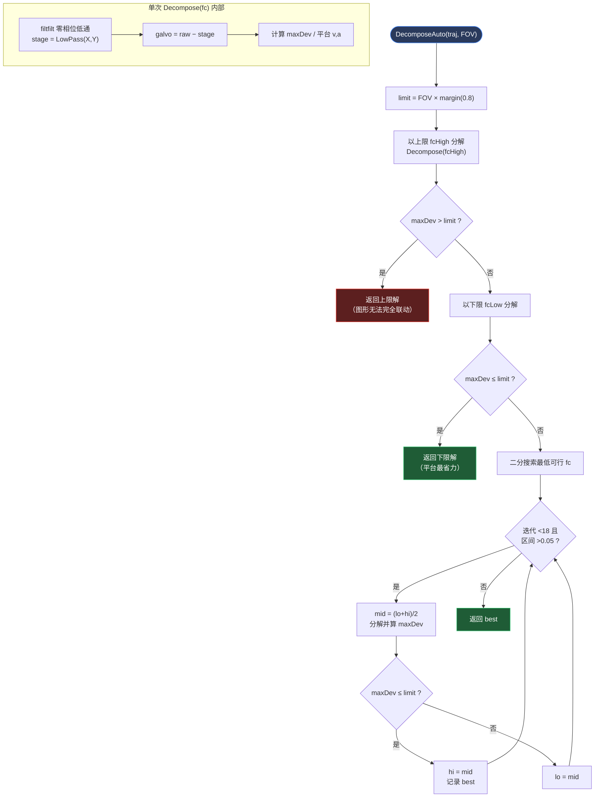
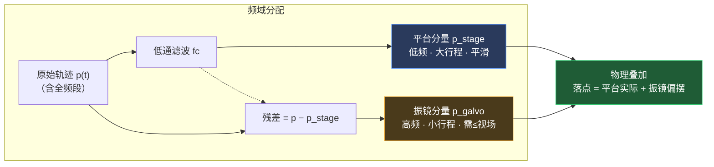
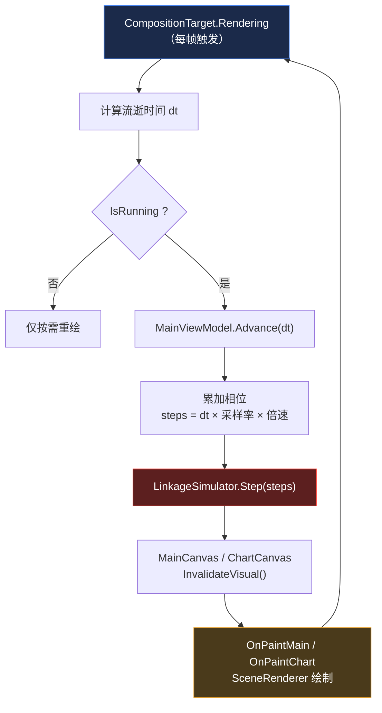
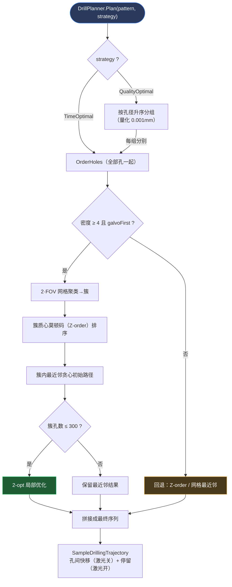

# 架构图

> 本文档以图示方式呈现系统的分层结构、数据流、类关系、控制时序与算法流程。
> 图表采用 [Mermaid](https://mermaid.js.org/) 语法，可在 VS Code、GitHub、Typora 等支持 Mermaid 的查看器中渲染。
> 概念说明见 [方案介绍](./方案介绍.md)，数学原理见 [算法详解](./算法详解.md)。

---

## 1. 系统分层架构

**分层原则**：核心算法层（Core）完全独立于 UI，可单独编译、测试与复用；表现层（App）仅负责参数输入、状态编排与可视化；验证层（SmokeTest）绕过 UI 直接驱动算法链路，便于回归测试。

---

## 2. 数据处理流水线

```mermaid
flowchart LR
    A["DXF 文件<br/>.dxf"] -->|DxfParser.ParseFile| B["折线集合<br/>List&lt;PathPolyline&gt;"]
    B -->|PathSampler.Sample| C["等时采样轨迹<br/>SampledTrajectory<br/>X[] Y[] LaserOn[]"]
    C -->|FrequencyDecomposer<br/>.DecomposeAuto| D["分解结果<br/>DecomposeResult<br/>Stage低频 + Galvo高频"]
    D -->|new LinkageSimulator<br/>.Step| E["联动仿真<br/>落点/误差/统计"]
    E -->|SceneRenderer| F["SkiaSharp 可视化<br/>轨迹 + 误差曲线"]

    style A fill:#333,stroke:#888,color:#fff
    style B fill:#333,stroke:#888,color:#fff
    style C fill:#2A3A5C,stroke:#4C8DFF,color:#fff
    style D fill:#1F5C36,stroke:#2ECC71,color:#fff
    style E fill:#5C1F1F,stroke:#FF3B30,color:#fff
    style F fill:#4A3A1B,stroke:#E6A02E,color:#fff
```

---

## 3. 核心类关系图

---

## 4. 联动控制时序（单个控制周期）

---

## 5. 频率分解算法流程

---

## 6. 频率分解信号示意

一维信号视角下，原始轨迹被拆分为低频（平台）与高频（振镜）两部分：

---

## 7. UI 实时渲染循环

---

## 8. 钻孔路径规划流程（振镜优先 + 双策略）

PCB 钻孔与折线加工并列。`DrillPlanner.Plan` 根据 `DrillingStrategy` 选择孔位访问顺序，均采用振镜优先聚类 + 分区内 2-opt TSP：

> **双模式加工**（`DecomposeBoth`）：折线轮廓与钻孔孔位采样后**拼接为单条轨迹**（先加工轮廓再环切圆孔）；其中 `FromCircle` 标记的圆轮廓从折线链路排除，避免圆被加工两次。

---

*如需静态图片（PNG/SVG），可将以上 Mermaid 代码粘贴至 [mermaid.live](https://mermaid.live) 导出。*
